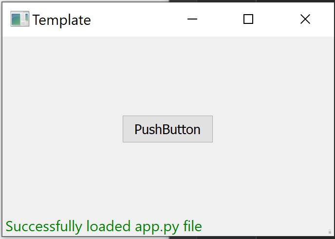

# Template for Model View Controller (MVC) in Python.


This repository provides a Model View Controller (MVC) design in using PyQt.
```ANSI
model-view-controller-template
│   README.md
│   app.py    
│
└─── model
│   │   model.py
│   
└─── view
│   │   view.py
│   │   main_view.ui
│   │   main_view.py
└─── controller
    │   controller.py
```

## Getting Started

### Prerequisites
1. Install [anaconda](https://www.anaconda.com/distribution/).
2. step up python environment
    ```buildoutcfg
    conda create --name mvc python=3.7
    ```
3. activate environment
    ```buildoutcfg
    conda activate mvc
    or
    source activate mvc
    ```

### Installation
Install required python libraries
```buildoutcfg
pip install -r requirement.txt

```
### Run Application (dev)
Run the following command on terminal
```buildoutcfg
python app.py
```

The ui is designed using `qt designer` and saved in `main_view.ui` in view directory.
You can make changes to `main_view.ui` and convert it to a python file using the following command.
```buildoutcfg
pyuic5 view/main_view.ui -o view/main_view_ui.py
```
### Deploy Application
Run the following command on terminal
```buildoutcfg
pyinstaller --noconsole -n mvc_application  app.py
```

This will create a `dist` folder with an `mvc_application` directory inside.
